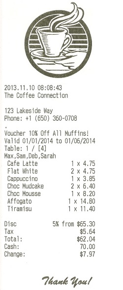

## Coffee Shop Till ☕ 
### Overview:

Here I have created a mock till for use in my dream coffee shop. The application creates a menu, from which items can be added to an order. A name should be assigned to the order before it is submitted, and then on submission a receipt is printed with the name, date and breakdown of the order items and costs.

This was an exercise in object oriented programming in Javascript. The user interface was created using HTML and CSS and the code was test-driven using the Jest framework.

This was orignally a mock tech test that I then decided to get more creative with.

### Original brief

We want to sell tills to a local hipster coffee shop who are finally embracing the 21st century. We need a new till to replace their vintage machines - unfortunately, hipster staff are too cool to learn a new system, so we need you to build something that they will understand.

This is what a sample receipt looks like:

Implement a system that contains the business logic to produce receipts similar to this, based on a `json` price list and test orders.  

Your receipt must calculate and show the correct amount of tax (in this shop's case, 8.64%), as well as correct line totals and total amount. Do not worry about calculating discounts or change yet. Consider what output formats may be suitable.

### Setup:

**To run this code locally:**  

    $ git clone https://github.com/rkirkbride13/tech-tests.git
    $ cd till
    $ npm install
    $ npm run build
    $ open index.html

**To run the test suite**
   
    $ git clone https://github.com/rkirkbride13/tech-tests.git
    $ cd till
    $ npm install
    $ jest

### Improvements:  

- Add functionality to take payment and calculate correct change.
- Add functionality to handle discounts - e.g a 5% discount on orders over $50, and a 10% muffin discount.
